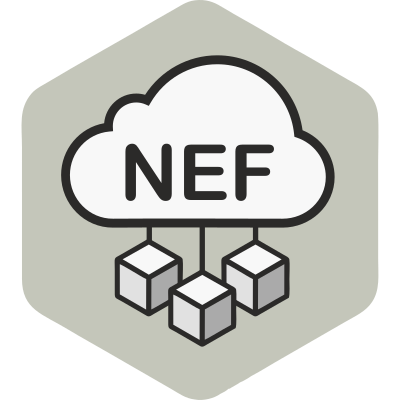

# NEF_emulator


<p align="center">
  
</p>

>This is a local implentation of the NEF emulator proposed by [EVOLVED-5G](https://5g-ppp.eu/evolved-5g-builds-the-first-3gpp-nef-emulator-to-support-smes-on-5g-programmability/).    
## ⚙ Setup locally

**Host prerequisites**: `docker`, `docker-compose 1.29.2`, `build-essential`\*, `jq`\*\*

After cloning the repository, there are 4 more steps to do. For convinience, we have created a [`Makefile`](Makefile) that contains a command for each step + several common `docker-compose` tasks which you may find handy in the future.

1. create your local `.env` file
2. build the container images
3. run the containers
4. add some test data (optional)

```bash
cd NEF_emulator

# 1.
make prepare-dev-env

# 2.
make build

# 3.
make up

# 4.
make db-init
```

>\* 💡 Info: *To use the `make` command you need to `apt install build-essential` first. In case you don't want to proceed with this installation, you can head over to the `Makefile` and copy/paste the shell commands that are being used for every step.*

> \*\* 💡 Info: *The shell script used at step 4 (for adding test data) uses `jq` which is a lightweight and flexible command-line JSON processor. You can install it with `apt install jq`*

### Try out your setup

After the containers are up and running:

 - access and start playing with the Swager UI at: [localhost:8888/nef/docs](http://localhost:8888/nef/docs)
 - login to the admin dashboard at: [localhost:8888/login](http://localhost:8888/login)
     - Default credentials: `admin@my-email.com` / `pass`
     - they can be found/changed inside your `.env` file

> For more in-depth details about the initial NEF emulator configuration, please visit the original repository [medianetlab/NEF_emulator](https://github.com/medianetlab/NEF_emulator).
---

## [5GASP](https://www.5gasp.eu/) guidelines and extensions
A key part of enmpowering the idea-to-market process in 5G Network Applications (NetApps) is to prove their 5G readinees. In 5GASP we propose the use of NEF to test the interaction between NetApps and 5G functionalies. We have tested and extended some capabilities from the NEF emulator prposed by the EVOLVED-5G project. Some quick guidelines for a local deployment are described next:

### 1. Create access token login:
Super user credentials  
  * Username = admin@my-email.com 
  * Password = pass  
  ```bash
  curl --location --request POST 'http://{url}/api/v1/login/access-token' \ 
  --header 'Accept: application/json' \ 
  --header 'Content-Type: application/x-www-form-urlencoded' \ 
  --data-raw 'grant_type=&username=admin%40my-email.com&password=pass&scope=&client_id=&client_secret=' 
  ```
please replace `{url}` with the address where the NEF emulator is running. If the request is successful, you will get an `access_token` and a `token_type`.

### 2. Test access token
  ```bash
curl --location --request POST 'http://{url}/api/v1/login/test-token' \
--header 'Accept: application/json' \ 
--header 'Content-Type: application/x-www-form-urlencoded' \ 
--header 'Authorization: Bearer {access_token}' 
  ```  
replace `access_token` with the value obtained in the previous step. If the request is successfull, details about the user will be returned.

### 3. Get UE info
  ```bash
  curl --location --request GET 'http://{url}/api/v1/UEs/{supi}' \ 
  --header 'Accept: application/json' \   
  --header 'Authorization: Bearer {access_token}' 
  ```
Replace `supi` with the UE ID from the emulator. 

### 4. Get UE serving cell (New)
```bash 
curl --location --request GET 'http://{url}api/v1/UEs/{supi}/serving_cell' \ 
--header 'Accept: application/json' \ 
--header 'Authorization: Bearer {token}' 
```
Replace `supi` with the UE ID from the emulator. 
### 5. Get UE distance to cells (New api)
Based on [Haversine formula](https://community.esri.com/t5/coordinate-reference-systems-blog/distance-on-a-sphere-the-haversine-formula/ba-p/902128#:~:text=For%20example%2C%20haversine(%CE%B8),longitude%20of%20the%20two%20points.) that determines the great-circle distance between two points on a sphere given their longitudes and latitudes. 

```bash 
curl --location --request GET 'http://{url}api/v1/UEs/{supi}/distances' \ 
--header 'Accept: application/json' \ 
--header 'Authorization: Bearer {token}' 
```
Replace `supi` with the UE ID from the emulator. 

### 6. Get UE path loss in reference to cells (New)
Based on the formula: $Path loss =28.0+22*log10⁡(d)+20 log10⁡( fc)$, 
from the 5G propagation model defined in [3GPP 36.873](https://portal.3gpp.org/desktopmodules/Specifications/SpecificationDetails.aspx?specificationId=2574). 
```bash
curl --location --request GET 'http://{url}api/v1/UEs/{supi}/path_losses' \ 
--header 'Accept: application/json' \ 
--header 'Authorization: Bearer {token}' 
```
Replace `supi` with the UE ID from the emulator. 

### 7. Get UE RSRP in reference to cells (New)
Based on the simplified formula: $RSRP = AntennaPower - Path Loss$, from the [3GPP TS 38.133](https://www.techplayon.com/5g-nr-rsrp-measurement-report-mapping/).
```bash
curl --location --request GET 'http://{url}api/v1/UEs/{supi}/rsrps' \ 
--header 'Accept: application/json' \ 
--header 'Authorization: Bearer {token}' 
```
Replace `supi` with the UE ID from the emulator. 

---


## ↔️ NetApp communication options

Below, you may find different options for establishing a bi-directional communication over HTTP between the NetApp and the NEF_emulator (for example to be used for `callbacks`).

### 1. via `host.docker.internal`

If you develop your NetApp directly on the host, for example a `Flask` app running on port `9999`:
 - you will be able to connect to the NEF_emulator at: `http://localhost:8888`
 - the NEF_emulator will **not** be able to connect to `http://localhost:9999` because "localhost" for a container is itself, not the host.
 - to overcome the above problem, Docker provides `host.docker.internal`
 - the NEF_emulator will be able to connect to `http://host.docker.internal:9999`
 - ⚠ make sure you bind your NetApp on `0.0.0.0:[port]` and not only on `127.0.0.1:[port]`

```
┌───────────────────────────────────────────────────────────────┐
│                          HOST                                 │
│                                                               │
│                        ┌───────────────────────────────┐      │
│      NetApp            │    docker-compose network     │      │
│         │              ├───────────────────────────────┤      │
│         │              │    NEF_emulator containers    │      │
│         │              │           live here           │      │
│         │              └── :80 ────────────── :5050 ───┘      │
│         │                   │                   │             │
│         │                   │                   │             │
└────── :9999 ───────────── :8888 ───────────── :5050 ──────────┘
          │                   │ 
          └─< communication >─┘
```

<br>

### 2. via the same docker `bridge` network

If you develop your NetApp as a container, the easiest way to establish a bi-directional communication would be to `attach` it to the pre-existing bridge network that the NEF_emulator containers use:
 - this bridge network is automatically created whenever you `docker-compose up` a project, in our case that would probably be named as `nef_emulator_default`
 - Docker will provide automatic DNS resolution between these containers names
 - your NetApp will be able to connect to the NEF_emulator at `http://backend`
 - the NEF_emulator will be able to connect to your NetApp at `http://your_netapp_container_name:9999`
 - ⚠ make sure you use the container ports directly, not the `published` ones
 - ⚠ make sure you first `docker-compose up` the NEF_emulator and then `attach` your NetApp container
 - more details at Docker docs: [Use bridge networks](https://docs.docker.com/network/bridge/) and [Networking in Compose](https://docs.docker.com/compose/networking/)

```
┌───────────────────────────────────────────────────────────────┐
│                          HOST                                 │
│                                                               │
│    ┌───────────────────────────────────────────────────┐      │
│    │               docker-compose network              │      │
│    ├───────────────────────────────────────────────────┤      │
│    │                                                   │      │
│    │  NetApp                NEF_emulator containers    │      │
│    │ also lives here               live here           │      │
│    │                                                   │      │
│    └─── :9999 ──────────── :80 ────────────── :5050 ───┘      │
│         │                   │                   │             │
│         ├─< communication >─┤                   │             │
│         │                   │                   │             │
│         │                   │                   │             │
└────── :9999 ───────────── :8888 ───────────── :5050 ──────────┘
```

Three possible ways to achieve the above approach:

1. with **docker**, try the `--net=...` option and provide the bridge name that you want to `attach` to:

       docker container run --net=nef_emulator_default ...

2. with **docker-compose**, try adding the bridge as an external network, something like:


       services:
       ....
           netapp:
           ....
               networks:
                  - nef_emulator_default
       networks:
         nef_emulator_default:
           external: true

3. with **docker network connect**, try adding your container to the bridge network:

       docker network connect BRIDGE_NAME NETAPP_NAME
